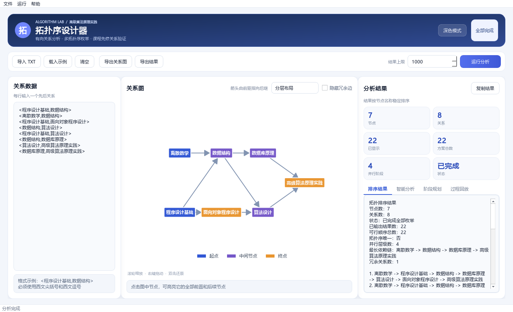
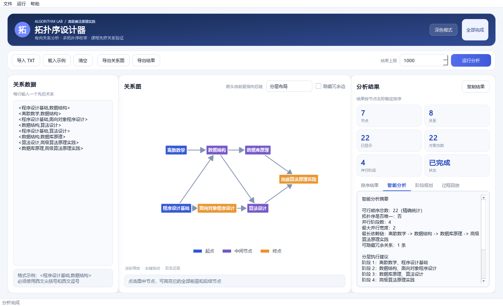
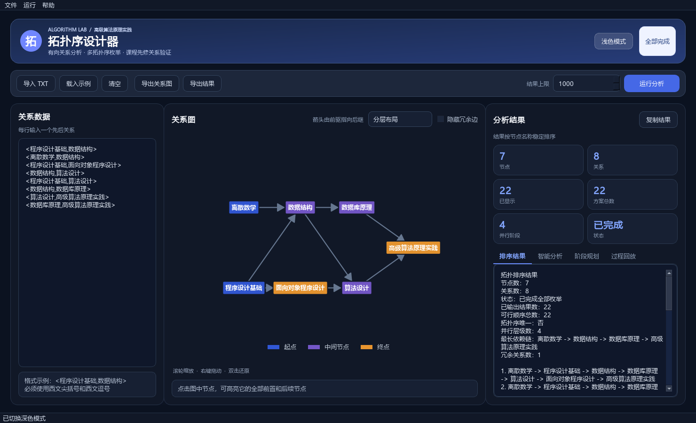
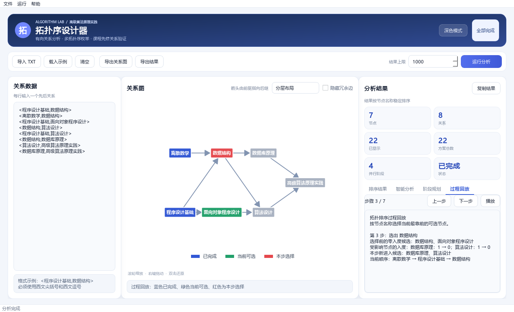

# 拓扑序设计器

“高级算法原理实践”本地桌面应用。程序使用 Python 3.12 和 PySide6 开发，能够输入或导入有向关系、绘制关系图、枚举多种拓扑排序、检测环并导出结果。

当前完整应用版本：`2.0.0`

## 组员快速入口

第一次操作程序请先看[使用说明](docs/使用说明.md)，其中有从启动到导出的完整步骤，以及新增功能和界面数字的解释。程序顶部也可以点击**帮助 → 使用说明**。

撰写需求、设计和项目报告时，优先查看：

- [课程任务书](2026年%20高级算法原理实践%20指导书（任务书）.pdf)：教师给出的功能、时间与验收要求
- [实践说明书](高级算法原理实践-实践说明书.md)：项目定位、验收方式、任务顺序和技术选择
- [任务说明书](高级算法原理实践-任务说明书.md)：五项分工、时间节点和任务依赖
- [项目现状](项目现状.md)：当前已经完成的功能、验证结果和后续事项
- [优化方向](优化方向文档.md)：最终高分功能规划与停止扩展边界
- [完整应用交付说明](docs/完整应用交付说明.md)：运行环境、功能结构和交接方法
- [使用说明](docs/使用说明.md)：运行程序、理解结果页、阶段规划和导出文件
- [测试人员验收清单](docs/测试人员验收清单.md)：人工测试范围和记录要求
- [项目报告模板](软件算法综合设计项目报告模板.doc)：报告负责人使用的原始模板
- [会议记录模板](会议记录-模版.doc)：小组会议记录原始模板

报告可直接使用 `docs/images/` 中的界面截图，并参考 `docs/技术一核心功能说明.md` 中的算法与异常处理说明。任务书图 1 的输入数据、关系图和排序结果分别位于 `examples/taskbook_figure1.txt`、`docs/images/任务书图1-关系图.png` 和 `docs/任务书图1-拓扑排序结果.txt`。

撰写前期报告时，以实践说明书和任务说明书作为设计依据，以项目现状区分“已经完成”和“后续计划”；优化方向中的未完成项目不要提前写成已经实现。



## 差异化亮点

- **精确方案计数**：18 个节点以内使用位掩码动态规划计算全部拓扑序总数，即使界面只展示前 1000 条，也能知道真实方案数。
- **并行层级规划**：自动把没有依赖冲突的节点放在同一阶段，可用于课程学习批次、项目并行任务和装配阶段建议。
- **最长依赖链**：自动找出依赖深度最大的关键链路，帮助识别最受约束的学习或执行路径。
- **拓扑序唯一性判断**：直接说明当前关系是否只有唯一合法顺序。
- **传递冗余关系识别**：检测可由其他路径推导出的关系，并允许在图中一键隐藏，提升复杂图的可读性。
- **交互关系探索**：点击节点后，高亮它的全部前置和后续节点，并显示直接关系。
- **三种关系图布局**：支持分层、力导向和环形布局。
- **深浅主题**：界面、关系图和导出画面可统一切换主题。
- **容量限制阶段规划**：设置每阶段最多安排的节点数；小规模图给出精确最少阶段数，大规模图给出明确标注的启发式建议。
- **复杂图可读性**：长链分行、长名称自动换行、悬停查看全名，导出图片使用独立高清画布。
- **算法过程回放**：逐步显示零入度候选、选择节点、入度变化和当前顺序，并在关系图中同步高亮。








## 主要功能

- 图形界面输入 `<前驱节点,后继节点>` 关系
- 从 UTF-8 TXT 文件导入关系数据
- 分层显示有向关系图
- PNG、SVG、PDF 关系图导出
- 尽可能枚举全部拓扑排序结果
- 可配置结果数量上限，并明确标记是否完整枚举
- TXT 排序结果导出
- 自环和普通有向环检测，并高亮具体环路
- 中文逗号、括号错误、空节点、重复关系等异常提示
- 后台执行计算，避免界面在枚举时失去响应
- 精确方案总数统计和智能分析
- 并行阶段、最长依赖链和唯一性判断
- 冗余关系识别与隐藏
- 节点点击高亮和多布局切换
- 深色与浅色主题
- 拓扑排序结果按 50 条一页浏览；复制和 TXT 导出保留本次已生成的全部结果
- 容量限制阶段规划、阶段着色和 TXT 规划导出
- 长链与长名称关系图自适应显示
- 第一个拓扑序的逐步解释、上一步/下一步和自动播放

## 运行环境

- Windows 10 或 Windows 11
- Python 3.12
- PySide6 6.11.2
- NetworkX 3.6.1
- Matplotlib 3.11.2

本机普通 `python` 可能指向其他版本，请统一使用 `py -3.12`。

## 最简单的运行方法

1. 安装 Python 3.12。
2. 双击 `安装依赖.bat`。
3. 双击 `启动应用.bat`。

`启动应用.bat`现在会立即启动图形程序并退出，加载时显示启动画面，不再留下等待中的终端。若希望完全不出现终端，可直接双击`launcher.vbs`。`run_app.bat`保留为显示 Python 错误的排查入口。

也可以在 VS Code 的 PowerShell 终端执行：

```powershell
py -3.12 -m pip install -r requirements.txt
$env:PYTHONPATH=(Resolve-Path .\src).Path
py -3.12 -m toposort_app
```

程序启动后已经提供一组课程关系示例，点击“运行分析”即可看到关系图和多个拓扑排序结果。

更详细的操作流程见[使用说明](docs/使用说明.md)。

若要验证培养方案课程数据，可导入 `examples/curriculum_2024_verified.txt`。该文件只包含从《2024版学业指南》“先修课程要求”列核实的部分关系；运行分析后可在“阶段规划”页设置每阶段最多安排的节点数。数据来源与限制见 `docs/培养方案数据核对说明.md`。

## 输入格式

每行输入一个关系，必须使用西文尖括号和西文逗号：

```text
<程序设计基础,数据结构>
<离散数学,数据结构>
<数据结构,算法设计>
```

`<a,b>` 表示 a 必须在 b 之前。

## 命令行核心演示

图形界面之外，核心模块仍可独立运行：

```powershell
$env:PYTHONPATH=(Resolve-Path .\src).Path
py -3.12 -m toposort_core examples\multiple.txt --limit 1000 --output results.txt
```

命令行退出状态：

- `0`：成功
- `2`：输入格式错误
- `3`：存在环
- `4`：文件读取或结果写入失败

## 技术二集成接口

```python
from toposort_core import solve_text

result = solve_text(input_text, max_results=1000)
```

界面使用 `result.errors`、`result.warnings`、`result.cycle`、`result.orders` 和 `result.is_complete` 显示对应状态，不需要修改核心模块内部代码。

## 项目检查

安装开发依赖：

```powershell
py -3.12 -m pip install -r requirements-dev.txt
```

运行检查：

```powershell
py -3.12 -m ruff check .
$env:QT_QPA_PLATFORM="offscreen"
py -3.12 -m pytest
```

生成界面预览图：

```powershell
$env:QT_QPA_PLATFORM="offscreen"
py -3.12 scripts\render_app_preview.py artifacts\app_preview.png
```

## 项目目录结构

```text
toposort-application/
├─ src/
│  ├─ toposort_core/           # 核心算法模块
│  │  ├─ parser.py             # 关系文本解析与格式检查
│  │  ├─ models.py             # 有向图和结果数据类型
│  │  ├─ solver.py             # 环检测与多拓扑序枚举
│  │  ├─ analysis.py           # 方案计数、分层、关键路径和冗余边分析
│  │  ├─ planning.py           # 带容量限制的阶段规划
│  │  ├─ tracing.py            # 一个拓扑序的逐步过程记录
│  │  ├─ io.py                 # 文件读取与结果导出
│  │  └─ cli.py                # 命令行入口
│  └─ toposort_app/            # 桌面应用模块
│     ├─ main_window.py        # 主窗口和交互流程
│     ├─ graph_view.py         # 关系图绘制与节点交互
│     ├─ workers.py            # 后台计算任务
│     ├─ theme.py              # 深浅色界面样式
│     └─ main.py               # 图形界面启动入口
├─ tests/                      # 核心、命令行、界面和启动测试
├─ examples/                   # 基础、任务书图1和已核实培养方案示例数据
├─ docs/
│  ├─ images/                  # 正式界面与关系图截图
│  ├─ 技术一核心功能说明.md
│  ├─ 完整应用交付说明.md
│  ├─ 测试人员验收清单.md
│  ├─ 使用说明.md
│  └─ 培养方案数据核对说明.md
├─ scripts/
│  └─ render_app_preview.py    # 界面预览图生成脚本
├─ 安装依赖.bat                # Windows双击安装入口
├─ 启动应用.bat                # Windows双击启动入口
├─ launcher.vbs                # 完全无终端的启动入口
├─ run_app.pyw                 # 图形模式启动与错误提示
├─ run_app.bat                 # 故障排查用的控制台入口
├─ install_dependencies.bat    # 实际执行依赖安装的脚本
├─ requirements.txt            # 运行依赖
├─ requirements-dev.txt        # 测试与代码检查依赖
├─ pyproject.toml              # Python项目配置
├─ 高级算法原理实践-实践说明书.md
├─ 高级算法原理实践-任务说明书.md
├─ 项目现状.md
├─ 优化方向文档.md
├─ 2026年 高级算法原理实践 指导书（任务书）.pdf
├─ 软件算法综合设计项目报告模板.doc
├─ 会议记录-模版.doc
└─ README.md
```

其中：

- `src/toposort_core/`可以脱离图形界面单独测试和调用。
- `src/toposort_app/`只负责界面、绘图和用户操作，通过公共接口调用核心模块。
- `examples/taskbook_figure1.txt`是任务书图1对应的关系数据。
- `examples/curriculum_2024_verified.txt`是依据培养方案明确先修要求核实的部分课程关系。
- `docs/images/`中的图片可以直接用于项目报告和阶段展示。
- `.venv/`、缓存、构建产物、临时截图、`本地视频材料/`及原始`测试数据/`、`测试结果/`已被Git忽略，不会自动上传到公开仓库。
